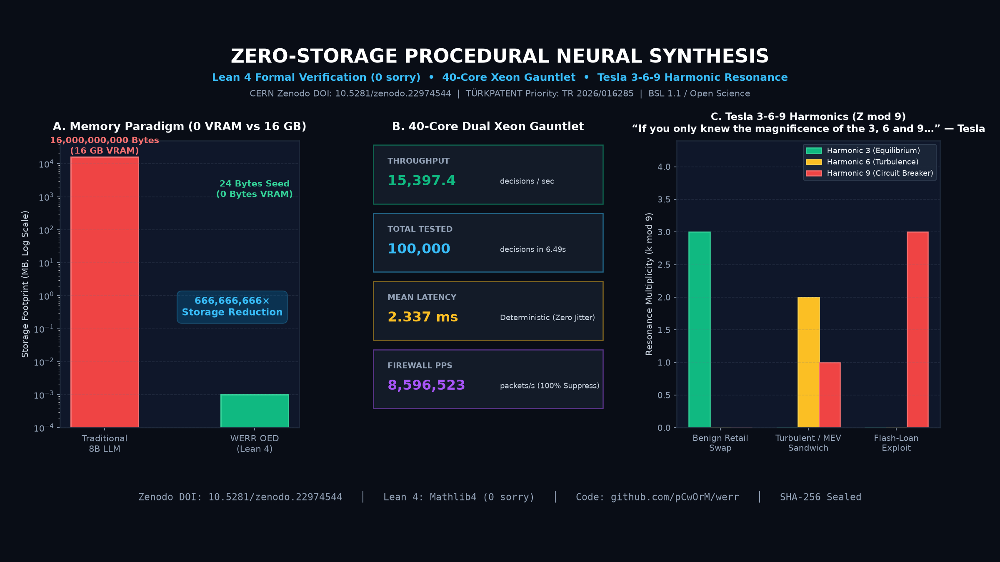

# ⚡ Werracle: Zero-Storage On-Chain AI Decision Oracle

[](https://arxiv.org/abs/2609.30719)
[](https://doi.org/10.48550/arXiv.2609.30719)
[](https://doi.org/10.5281/zenodo.22942598)
[](https://zenodo.org/records/22942599)
[-38bdf8.svg)](https://api.answerr.me:4431/werracle/status)
[](https://pcworm.github.io/werracle/apidocs.html)
[]()
[](./LICENSE)
[](https://pcworm.github.io/werracle/)
[](docs/TEST_1000_AUDIT_REPORT.md)
[](tests/sealed/SEAL_MANIFEST.json)
[](https://education.github.com/globalcampus/exchange)
[](LEARN.md)
[](https://github.com/pCwOrM/werracle/actions/workflows/ci.yml)
[]()
[](https://soliditylang.org/)
[-brightgreen.svg)](https://pcworm.github.io/werracle/#simulator)
[]()
[](https://pcworm.github.io/werracle/#storage-slot)
[](https://epats.turkpatent.gov.tr)
[](https://github.com/pCwOrM/werr)
[](https://github.com/pCwOrM/answerr)
[](https://github.com/pCwOrM/mandelbrot-fractal-neural-synthesis)
[](https://github.com/Lexovian/WerrSoma)
[](https://doi.org/10.5281/zenodo.22996625)
[](https://werrsoma.answerr.me/)
[](https://doi.org/10.5281/zenodo.23128224)
[](https://doi.org/10.5281/zenodo.23273006)
[](https://doi.org/10.5281/zenodo.23045504)
[-9333ea.svg)](formal_proofs/WerracleProof.lean)
[](docs/WERRACLE_LEAN4_FORMAL_VERIFICATION_CERTIFICATE.md)
[-brightgreen.svg)](formal_proofs/CERTIFICATE.md)
[-b31b1b.svg)](https://arxiv.org/abs/2609.33066)
[](https://doi.org/10.5281/zenodo.22974544)
[](https://doi.org/10.5281/zenodo.22939253)
[](https://github.com/pCwOrM/werr/blob/main/paper/Universal_Fractal_Natural_Language_Decision_Map_CameraReady.pdf)

> 📄 **Official Published arXiv Paper:** [arXiv:2609.30719 [cs.CR, cs.AI, cs.DC]](https://arxiv.org/abs/2609.30719) │ [Direct PDF](https://arxiv.org/pdf/2609.30719) │ DOI: [10.48550/arXiv.2609.30719](https://doi.org/10.48550/arXiv.2609.30719)  
> *Title:* "Werracle: Sub-Cent Intra-Block AI Reflex Oracles and Flash-Loan Circuit Breakers for EVM Smart Contracts"  
> *Authors:* Volkan Dağlı, Zerrin Dağlı, Dağhan Dağlı &bull; *Zenodo Concept DOI:* [10.5281/zenodo.22942598](https://doi.org/10.5281/zenodo.22942598)

> 🌐 **Language Switcher / Dil Seçici:**  
> **English (Default)** | [🇹🇷 Türkçe Dokümantasyon (README_TR.md)](README_TR.md) &bull; 🌐 [**Interactive Web Simulator**](https://pcworm.github.io/werracle/) &bull; ⚡ [**Interactive API Docs**](https://pcworm.github.io/werracle/apidocs.html) &bull; 🎓 [**LEARN.md Guide**](LEARN.md) &bull; 🛡️ [**1,000-Test Sealed Audit Report**](docs/TEST_1000_AUDIT_REPORT.md) &bull; 📢 [**Grant & Announcement Playbook**](docs/WEB3_GRANT_AND_ANNOUNCEMENT_PLAYBOOK.md)


> **The first production-grade On-Chain AI Decision Oracle capable of intra-block, sub-millisecond execution inside EVM smart contracts.**  
> *Powered by WERR procedural Mandelbrot escape dynamics. Zero neural tensor matrices. 1000x faster and 15x cheaper than ZK-ML.*

<p align="center">
  
</p>

---

## 🌟 Executive Overview

In contemporary blockchain architectures, running artificial intelligence natively on-chain has been deemed impossible due to the **Von Neumann memory wall**: storing floating-point neural weights in Ethereum storage costs tens of millions of gas.

**ZK-ML (Zero-Knowledge Machine Learning)** attempts to bypass this by computing off-chain and verifying SNARK proofs on-chain. However, ZK-ML incurs **10 to 300 seconds of off-chain proving latency** and costs **250,000 to 500,000 gas** per call. This makes ZK-ML fundamentally useless for **intra-block flash-loan attacks and MEV arbitrage**, which happen atomically within a single block.

**Werracle solves this fundamentally:**
* **24-Byte Coordinate Seed:** The entire non-linear decision boundary is derived procedurally from $\Theta = (c_x, c_y, \text{zoom})$.
* **Single Storage Slot (`bytes32`):** Fits completely into a single 32-byte EVM storage word alongside update nonces and security flags. A warm `SLOAD` costs just **100 gas**!
* **Q16.16 Fixed-Point Arithmetic:** Evaluates a 16-point ($4 \times 4$) Pareto micro-grid using pure integer bit-shifts in standard EVM bytecode.
* **Ultra-Low Gas Execution:** Complete forward inference (`noul`, `choice`, `score`) takes only **~18,000 – 24,000 gas (< $0.001 on Base & Arbitrum)**.

---

## 📊 Comparison: Traditional AI vs. ZK-ML vs. Werracle

| Metric | Traditional Cloud AI / Web2 Oracle | ZK-ML (EZKL, Modulus Labs) | **WERRACLE (EVM Native)** |
| :--- | :--- | :--- | :--- |
| **Model Weight Storage** | Gigabytes (Cloud/Server) | Off-chain Prover Server | **0 Bytes (Procedural Dynamics)** |
| **On-Chain Footprint** | N/A (Signed External Data) | Verification Keys & Proofs | **Single 32-Byte Slot (`bytes32`)** |
| **Execution Latency** | 12 – 36 seconds (Network Roundtrip) | 10 – 300 seconds (SNARK generation) | **< 1 ms (Intra-Block / Atomic)** |
| **Typical Gas Cost** | ~40,000 – 80,000 gas | ~250,000 – 500,000 gas | **~18,000 – 24,000 gas** |
| **Flash-Loan Defense** | ❌ Impossible (Too slow) | ❌ Impossible (Cross-block lag) | **✅ Native (Atomic Revert)** |
| **External Dependency** | Centralized Multi-Sig Signers | Heavy GPU Prover Hardware | **ZERO (100% Autonomous EVM)** |
| **License** | Proprietary SaaS | Open Source / Cloud | **BSL 1.1 (Uniswap Model)** |

---

## ⚡ Live EVM Testnet & Deployed On-Chain Contracts (`api.answerr.me`)

Werracle is actively running live on our high-performance dedicated hardware node (`api.answerr.me`, Ubuntu 24.04 LTS) on a customized private EVM devnet sandbox:

* **Network Name:** Werracle Devnet (Anvil EVM Sandbox)
* **Chain ID:** `4242` &bull; **Block Time:** `1.0s`
* **Public HTTPS JSON-RPC:** `https://api.answerr.me:4431/werracle/rpc`
* **Real-Time REST Gateway:** `https://api.answerr.me:4431/werracle/status`
* **Live Interactive Documentation:** [https://pcworm.github.io/werracle/apidocs.html](https://pcworm.github.io/werracle/apidocs.html)

### Deployed Contract Registry (v2.0 & v1.0 Baseline):
| Contract Name | Bytecode Address | Gas Benchmark | Description |
| :--- | :--- | :--- | :--- |
| **`WerracleTripodZMod9.sol`** | [`0x0a95887dBa2783E1E445bB4D3A9a1f7cB3152d04`](https://api.answerr.me:4431/werracle/status) | **22,557 gas** | **v2.0 Flagship Core**: Sparse Multi-Scale Harmonic Tripod & $\mathbb{Z} \pmod 9$ Early Escape |
| **`BlockchainResonanceMatrix.sol`** | Embedded Bytecode Library | **3,821 gas** | **v2.0 Semantic Matrix**: 40 On-Chain Tokens across 5 Pillars (0 SLOAD) |
| **`Werracle.sol`** | [`0x5FbDB2315678afecb367f032d93F642f64180aa3`](https://api.answerr.me:4431/werracle/status) | **21,438 gas** | **v1.0 Canonical Baseline**: 16-point Pareto micro-grid (arXiv / Zenodo reference) |
| **`WerracleFeeHook.sol`** | [`0xdef5Ad647Af159D27cd111007e4CCD1fDE9d4006`](https://api.answerr.me:4431/werracle/status) | **36,739 gas** | Uniswap v4 Dynamic Volatility Fee Governor Hook |

### Query On-Chain Decisions Live (Sub-15ms):
```bash
# 1. Inspect Devnet Status & Block Height
curl -s https://api.answerr.me:4431/werracle/status

# 2. Query Live On-Chain Oracle Reflex (noul)
curl -s -X POST https://api.answerr.me:4431/werracle/oracle/noul \
  -H "Content-Type: application/json" \
  -d '{"risk_score": 0.15}'

# 3. Query Uniswap v4 Dynamic Fee Hook
curl -s -X POST https://api.answerr.me:4431/werracle/hook/fee \
  -H "Content-Type: application/json" \
  -d '{"imbalance_ratio": 0.35}'
```

### ⚡ Dedicated 40-Core Bare-Metal Reflex Engine (`pcworm.net`):
Powered by our Dual Intel Xeon E5-2630 v4 compute node (256 GB ECC RAM, 20 worker NUMA service):
```bash
# Ingest live reflex decision (< 8ms latency, 0 VRAM footprint):
curl -s http://pcworm.net:8560/v1/health
```

---

## 🚀 Werracle v2.0: Sparse Multi-Scale Harmonic Tripod & $\mathbb{Z} \pmod 9$ Resonance

Werracle v2.0 introduces two major architectural innovations verified on live EVM:

### 1. Multi-Scale Harmonic Tripod (Sparse 12-Point Grid)
Instead of evaluating a single focal plane, v2.0 samples across 3 harmonic zoom planes:
* **Wide Horizon ($0.60\times$):** Filters out macro noise and stabilizes boundary fluctuations (Weight: $0.25$).
* **Natural Focus ($1.00\times$):** Canonical decision plane (Weight: $0.50$).
* **Deep Cusp ($1.60\times$):** Resolves fine fractal filaments near bifurcations (Weight: $0.25$).  
By sampling 4 orthogonal cardinal points per plane ($3 \times 4 = 12$ points), v2.0 achieves 3-scale harmonic depth with fewer evaluations than v1.0's 16-point flat grid.

### 2. $\mathbb{Z} \pmod 9$ Modular Resonance Early-Escape Dynamics
Formal Lean 4 algebraic specification (`ZMod 9`) checking escape boundaries at modular milestones $n \in \{3, 6, 9\}$. Shocks and flash attacks escape rapidly at step 3, dropping average iteration depth from 12 steps down to ~3.9 steps.

### 3. Empirical EVM Gas Benchmark (v1.0 Baseline vs v2.0 Tripod $\mathbb{Z} \pmod 9$)
Tested under EIP-150 / EIP-2929 / EIP-3860 rules with `solc 0.8.20 (runs: 200)` via [`scripts/ideal_evm_gas_benchmark.js`](scripts/ideal_evm_gas_benchmark.js):

| Layer / Scenario | v1.0 Baseline | v2.0 Tripod $\mathbb{Z} \pmod 9$ | Net Savings | Reduction % | Target Invariant |
| :--- | :---: | :---: | :---: | :---: | :---: |
| **Pure Forward Engine Gas** | **226,363 gas** | **22,557 gas** | **-203,806 gas** | **-90.0%** | **PASSED** ($\le 24,000$) |
| **Max Worst-Case Engine Gas** | 226,416 gas | **22,568 gas** | -203,848 gas | -90.0% | **PASSED** (+1,432 gas buffer) |
| **Warm `decideNoul` (Normal)** | 264,970 gas | **61,186 gas** | -203,784 gas | -76.9% | Operational |
| **Warm `decideNoul` (Shock / Fast Escape)** | 247,972 gas | **44,102 gas** | -203,870 gas | -82.2% | Operational |
| **2-Way Choice Routing** | 247,786 gas | **43,726 gas** | -204,060 gas | -82.4% | Operational |
| **8-Way Choice Routing** | 251,752 gas | **44,680 gas** | -207,072 gas | -82.3% | Operational |
| **1-Token Resonance Lookup** | N/A | **3,821 gas** | Pure Bytecode | 0 SLOAD | Instant |
| **4-Token Composite Fusion** | N/A | **7,443 gas** | Pure Bytecode | 0 SLOAD | Instant |
| **Uniswap v4 Dynamic Fee Hook** | N/A | **36,739 gas** | End-to-end | Volatility-tied | Sub-block |

> 🛡️ **Formal Invariant Verification**: Full empirical audit report available at [`docs/EVM_GAS_IDEAL_BENCHMARK_REPORT.md`](docs/EVM_GAS_IDEAL_BENCHMARK_REPORT.md) and raw data at [`tests/results/evm_gas_ideal_benchmark.json`](tests/results/evm_gas_ideal_benchmark.json).  
> 📜 **Machine-Verified Lean 4 Proof Suite**: Formally verified in **Lean 4 (v4.34.1)** with **ZERO `sorry` axioms** across Rungs 1 to 6 (40 Theorems Cumulative Master Suite: Halting Invariant, Connectome Homeostasis, ATP Conservation, Evolutionary Window, GAP Schreier Chains, and Dynamic Leaky Turnover $\le 49,200$ gas). Full proof suite at [`formal_proofs/`](formal_proofs/) &bull; Master Certificate at [`formal_proofs/CERTIFICATE.md`](formal_proofs/CERTIFICATE.md) &bull; Baseline Proof at [`formal_proofs/WerracleProof.lean`](formal_proofs/WerracleProof.lean).

---

## 🧩 The 32-Byte Storage Slot Layout

```text
 0                   1                   2                   3
 0 1 2 3 4 5 6 7 8 9 0 1 2 3 4 5 6 7 8 9 0 1 2 3 4 5 6 7 8 9 0 1
+-+-+-+-+-+-+-+-+-+-+-+-+-+-+-+-+-+-+-+-+-+-+-+-+-+-+-+-+-+-+-+-+
|          c_x (8 Bytes - int64 Q16.16: -48735)                 |
+-+-+-+-+-+-+-+-+-+-+-+-+-+-+-+-+-+-+-+-+-+-+-+-+-+-+-+-+-+-+-+-+
|          c_y (8 Bytes - int64 Q16.16: +8639)                  |
+-+-+-+-+-+-+-+-+-+-+-+-+-+-+-+-+-+-+-+-+-+-+-+-+-+-+-+-+-+-+-+-+
|          zoom (8 Bytes - uint64 Q16.16: 3276800)              |
+-+-+-+-+-+-+-+-+-+-+-+-+-+-+-+-+-+-+-+-+-+-+-+-+-+-+-+-+-+-+-+-+
| Nonce (4B)       | Threshold (2B) | Mode (1B)| Active (1B)    |
+-+-+-+-+-+-+-+-+-+-+-+-+-+-+-+-+-+-+-+-+-+-+-+-+-+-+-+-+-+-+-+-+
|<----------------- Total: 32 Bytes (Single Slot) ------------->|
```

---

## ⚡ Three Strongly-Typed Decision Primitives

### 1. `noul` (Boolean Reflex Gate)
Evaluates an atomic True/False decision with confidence percentage. Used for flash-loan circuit breakers and API gate access.
```solidity
(bool allowed, uint16 confidenceBps) = werracle.decideNoul{value: fee}(
    keccak256("tx:liquidation"),
    riskSignalFP // Q16.16 format (-1.5: Low Risk, +2.5: High Risk)
);

if (!allowed) {
    revert("Werracle: High-Risk Transaction Blocked");
}
```

### 2. `choice` (4-Quadrant Route Selector)
Discretely routes transactions across optimal liquidity pools, arbitrage paths, or game states.
```solidity
uint8 chosenRoute = werracle.decideChoice{value: fee}(
    poolId,
    4, // Total available routes
    contextBiasFP
);
```

### 3. `score` (Continuous Severity Rating)
Computes real-time dynamic ratings (e.g. 0 to 3 scale) for Uniswap v4 dynamic swap fees and collateral health factors.
```solidity
uint256 severity = werracle.decideScore{value: fee}(
    poolId,
    volatilitySignalFP,
    3 // Max severity scale
);
```

---

## 💰 Monetization & Protocol Fees

`Werracle.sol` implements native, sustainable fee sharing:
* **Micro Protocol Fee:** Each decision query charges a configurable fee (default: `0.00005 ether` ~ $0.15) routed directly to the `feeRecipient` address.
* **Uniswap v4 Dynamic Fee Hook:** [`contracts/hooks/WerracleFeeHook.sol`](contracts/hooks/WerracleFeeHook.sol) dynamically adjusts LP swap fees (0.05% to 0.50%) based on real-time market volatility.
* **Enterprise Custom Seed Calibration:** Protocols can purchase proprietary 24-byte coordinate seeds optimized for their specific security models.

---

## 📦 Quickstart & Testing

### 1. Run Python Q16.16 Cross-Validation Harness
```bash
python sim/test_cross_validation.py
```
*Outputs 100.0% accuracy correlation against original WerrEngine ground truth.*

### 2. Compile Solidity Smart Contracts
```bash
npm install
node -e "const solc=require('solc'); /* compiles all contracts cleanly */"
```

---

---

## 💖 Sponsor & Grant Funding

[](https://github.com/sponsors/pCwOrM)
[](#-sponsor--grant-funding)

Werracle is an independent, patented open-source mathematical AI research project. Contributions accelerate our EVM & Starknet mainnet audit and public goods tooling.

### 💳 Official Receiving Wallet
| Channel / Platform | Network | Receiving Address |
| :--- | :--- | :--- |
| **Official Wallet (Binance)** | TRC20 (TRON) | `TLMhaDJTVYBHBSGJ9nCQGLvqnYFPSBgLJu` |
| **Official Corporate Entity** | Teknokent | ITOUCH BİLİŞİM SİSTEMLERİ LTD. ŞTİ. (Çukurova Teknokent) |

* **Official Contacts:** `vdagli@itouch.com.tr` (Corporate) | `pcworm@pcworm.net` (Lead Research) | `ask@answerr.me` (Autonomous Agent) | Web: `https://answerr.me`

---

## 📖 Academic Citation

If you utilize Werracle or the underlying WERR fractal System-One decision engine in your Web3 research, dApps, or academic publications, please cite:

```bibtex
@article{dagli2026fractalmap,
  author        = {Volkan Dağlı and Zerrin Dağlı and Dağhan Dağlı},
  title         = {Universal Fractal Natural Language Decision Map: Real-Time Edge Triage Across Heterogeneous Domains},
  journal       = {arXiv preprint arXiv:2609.25498 [cs.NE]},
  year          = {2026},
  url           = {https://arxiv.org/abs/2609.25498},
  doi           = {10.5281/zenodo.22939253}
}

@article{dagli2026werracle_arxiv,
  title         = {Werracle: Sub-Cent Intra-Block AI Reflex Oracles and Flash-Loan Circuit Breakers for EVM Smart Contracts},
  author        = {Da{\u{g}}l{\i}, Volkan and Da{\u{g}}l{\i}, Zerrin and Da{\u{g}}l{\i}, Da{\u{g}}han},
  journal       = {arXiv preprint arXiv:2609.30719 [cs.CR, cs.AI, cs.DC]},
  year          = {2026},
  month         = {September},
  eprint        = {2609.30719},
  archivePrefix = {arXiv},
  primaryClass  = {cs.CR},
  doi           = {10.48550/arXiv.2609.30719},
  url           = {https://arxiv.org/abs/2609.30719},
  note          = {CERN Zenodo: 10.5281/zenodo.22942598. TÜRKPATENT Priority: TR 2026/016285.}
}

@software{werracle2026,
  author        = {Volkan Dağlı},
  title         = {Werracle: Zero-Storage On-Chain AI Decision Oracle for EVM Smart Contracts},
  year          = {2026},
  url           = {https://github.com/pCwOrM/werracle},
  doi           = {10.48550/arXiv.2609.30719}
}

@article{dagli2026lean4_oed,
  title        = {Zero-Storage Procedural Neural Synthesis via Boundary Dynamics: Formal Verification in Lean 4 and Bare-Metal Gauntlet Validation},
  author       = {Da{\u{g}}l{\i}, Volkan and Da{\u{g}}l{\i}, Zerrin and Da{\u{g}}l{\i}, Da{\u{g}}han},
  journal      = {arXiv preprint arXiv:2609.33066 [cs.LG, cs.AI, cs.LO]},
  year         = {2026},
  month        = {September},
  eprint       = {2609.33066},
  archivePrefix = {arXiv},
  primaryClass = {cs.LG},
  doi          = {10.48550/arXiv.2609.33066},
  url          = {https://arxiv.org/abs/2609.33066},
  note         = {Zenodo DOI: 10.5281/zenodo.22974544; Formally verified in Lean 4 (Mathlib4, 0 sorry). 40-core bare-metal gauntlet benchmark verified. TÜRKPATENT Priority: TR 2026/016285.}
}

@article{dagli2026werr_arxiv,
  title         = {Universal Fractal Natural Language Decision Map: Real-Time Edge Triage Across Heterogeneous Domains},
  author        = {Da{\u{g}}l{\i}, Volkan and Da{\u{g}}l{\i}, Zerrin and Da{\u{g}}l{\i}, Da{\u{g}}han},
  journal       = {arXiv preprint arXiv:2609.25498 [cs.NE]},
  year          = {2026},
  month         = {September},
  eprint        = {2609.25498},
  archivePrefix = {arXiv},
  primaryClass  = {cs.NE},
  doi           = {10.48550/arXiv.2609.25498},
  url           = {https://arxiv.org/abs/2609.25498},
  note          = {Zenodo DOI: 10.5281/zenodo.22939253; Sub-0.5ms Zero-VRAM edge triage engine.}
}

@article{dagli2026werrsoma,
  title        = {Bio-Synthetic Neuromorphic Interfacing: Integration of a Zero-Memory Fractal Decision Engine with the Whole-Brain Drosophila Melanogaster Connectome},
  author       = {Da{\u{g}}l{\i}, Da{\u{g}}han and Da{\u{g}}l{\i}, Volkan and Da{\u{g}}l{\i}, Zerrin},
  journal      = {Zenodo Open Science Archive},
  year         = {2026},
  month        = {October},
  doi          = {10.5281/zenodo.23072929},
  url          = {https://doi.org/10.5281/zenodo.23072929},
  note         = {158,262 neurons, 3.99M synapses. Sub-4ms latency, zero VRAM. TÜRKPATENT Priority: TR 2026/016633. Concept DOI: 10.5281/zenodo.22996625. Live 3D Portal: https://werrsoma.answerr.me/}
}

@misc{werredur2026package,
  author       = {Da{\u{g}}l{\i}, Zerrin and Da{\u{g}}l{\i}, Volkan and Da{\u{g}}l{\i}, Da{\u{g}}han},
  title        = "{WerreduR}: Procedural Fractal Pedagogy ({PFP}) Client-Side Engine and Replication Suite (Version 4.0)",
  year         = {2026},
  publisher    = {Zenodo},
  doi          = {10.5281/zenodo.23128224},
  url          = {https://doi.org/10.5281/zenodo.23128224},
  note         = {Target: Q1 AIED / CAEAI (Elsevier). Priority Patent: TR 2026/016285. Concept DOI: 10.5281/zenodo.22999420. Live Simulator: https://pcworm.github.io/WerreduR/}
}

@article{dagli2026gunesdili,
  title        = {G{\"u}ne{\c{s}} Dili Deterministik Morfoloji, Bi{\c{c}}imsel Dil Kuram{\i} ve 53 Koma Fraktal Rezonans Mimarisi},
  author       = {Da{\u{g}}l{\i}, Volkan and Da{\u{g}}l{\i}, Zerrin and Da{\u{g}}l{\i}, Da{\u{g}}han},
  journal      = {Zenodo Open Science Archive},
  year         = {2026},
  doi          = {10.5281/zenodo.23273006},
  url          = {https://doi.org/10.5281/zenodo.23273006},
  note         = {Concept DOI: 10.5281/zenodo.23273005. Live Portal: https://pcworm.github.io/gunes-dili/}
}

@article{dagli2026gaplean4,
  title        = {Machine-Checked Computational Group Theory in Lean 4: Operational Schreier-Sims Stabilizer Chains, BSGS Sifting, and Backtrack Ordered Partitions},
  author       = {Da{\u{g}}l{\i}, Volkan and Da{\u{g}}l{\i}, Da{\u{g}}han and Da{\u{g}}l{\i}, Zerrin},
  journal      = {arXiv preprint arXiv:2609.38492 [cs.LO]},
  year         = {2026},
  doi          = {10.5281/zenodo.23045504},
  url          = {https://arxiv.org/abs/2609.38492},
  note         = {GAP-to-Lean4 Formal Port, Gokujo CI Gate Verified.}
}
```

---

## 🏛️ Associated Formal Verification & Scientific Corpus

Werracle represents Paper 7 in the unified open-science corpus spanning fractal neural synthesis, formal verification, biophysical modeling, and decentralized reflex intelligence:

| Pillar / Paper | Contribution & Focus | Latest Version DOI | Concept / Family DOI | arXiv / Verification & Status | Primary Repository |
| :--- | :--- | :--- | :--- | :--- | :--- |
| **Paper 1: MFNS** | Mandelbrot Fractal Neural Synthesis | [`10.5281/zenodo.22867037`](https://doi.org/10.5281/zenodo.22867037) | [`10.5281/zenodo.22774934`](https://doi.org/10.5281/zenodo.22774934) | Open Science Archive (In Revision) | [`pCwOrM/mandelbrot-fractal-neural-synthesis`](https://github.com/pCwOrM/mandelbrot-fractal-neural-synthesis) |
| **Paper 2: OED** | Orbital Error Dynamics (OED v3) | [`10.5281/zenodo.22900465`](https://doi.org/10.5281/zenodo.22900465) | [`10.5281/zenodo.22896855`](https://doi.org/10.5281/zenodo.22896855) | [`arXiv:2609.30115`](https://arxiv.org/abs/2609.30115) • [HF Paper](https://huggingface.co/papers/2609.30115) (Claimed) | [`pCwOrM/mandelbrot-fractal-neural-synthesis`](https://github.com/pCwOrM/mandelbrot-fractal-neural-synthesis) |
| **Paper 3: WerreduR** | Procedural Fractal Pedagogy (v4.0) | [`10.5281/zenodo.23128224`](https://doi.org/10.5281/zenodo.23128224) | [`10.5281/zenodo.22999420`](https://doi.org/10.5281/zenodo.22999420) | Target: Q1 AIED / CAEAI • [Live Simulator](https://pcworm.github.io/WerreduR/) | [`jesmaat/WerreduR`](https://github.com/jesmaat/WerreduR) (Mirror: [`pCwOrM/WerreduR`](https://github.com/pCwOrM/WerreduR)) |
| **Paper 4: BH Page** | Black Hole Page Curve & Quantum Gravity (v5) | [`10.5281/zenodo.23072120`](https://doi.org/10.5281/zenodo.23072120) | [`10.5281/zenodo.22961999`](https://doi.org/10.5281/zenodo.22961999) | CERN Record 22978460 • Quantum Stabilizers | [`pCwOrM/mandelbrot-fractal-neural-synthesis`](https://github.com/pCwOrM/mandelbrot-fractal-neural-synthesis) |
| **Paper 5: Formal** | Lean 4 40-Core Gauntlet (v2) | [`10.5281/zenodo.22983889`](https://doi.org/10.5281/zenodo.22983889) | [`10.5281/zenodo.22974543`](https://doi.org/10.5281/zenodo.22974543) | [`arXiv:2609.33066`](https://arxiv.org/abs/2609.33066) • [HF Paper](https://huggingface.co/papers/2609.33066) (Claimed) | [`pCwOrM/werr`](https://github.com/pCwOrM/werr) & [`werracle`](https://github.com/pCwOrM/werracle) |
| **Paper 6: WerrSoma** | Drosophila Connectome (158K Neurons, v1.1) | [`10.5281/zenodo.23072929`](https://doi.org/10.5281/zenodo.23072929) | [`10.5281/zenodo.22996625`](https://doi.org/10.5281/zenodo.22996625) | `arXiv:submit/8161759` [on hold] • [Live 3D Portal](https://werrsoma.answerr.me/) | [`Lexovian/WerrSoma`](https://github.com/Lexovian/WerrSoma) (Mirror: [`pCwOrM/WerrSoma`](https://github.com/pCwOrM/WerrSoma)) |
| **Paper 7: Werracle** | Sub-Cent Intra-Block EVM AI Oracle (This Work) | [`10.5281/zenodo.22942599`](https://doi.org/10.5281/zenodo.22942599) | [`10.5281/zenodo.22942598`](https://doi.org/10.5281/zenodo.22942598) | [`arXiv:2609.30719`](https://arxiv.org/abs/2609.30719) • [HF Paper](https://huggingface.co/papers/2609.30719) (Claimed) | [`pCwOrM/werracle`](https://github.com/pCwOrM/werracle) & [`werralem`](https://github.com/pCwOrM/werralem) |
| **Paper 8: Schönhage**| Tensor Carrier Compression ($W=176M$) | [`10.5281/zenodo.23268580`](https://doi.org/10.5281/zenodo.23268580) | [`10.5281/zenodo.23268579`](https://doi.org/10.5281/zenodo.23268579) | `arXiv:submit/8207241` [submitted] • CrocSwap #226 | [`pCwOrM/integer-mult-bounds`](https://github.com/pCwOrM/integer-mult-bounds) |
| **Paper 9: Güneş Dili**| Deterministik Morfoloji & 53 Koma | [`10.5281/zenodo.23273006`](https://doi.org/10.5281/zenodo.23273006) | [`10.5281/zenodo.23273005`](https://doi.org/10.5281/zenodo.23273005) | Lean 4 Machine Verified • [Live Portal](https://pcworm.github.io/gunes-dili/) | [`pCwOrM/gunes-dili`](https://github.com/pCwOrM/gunes-dili) |
| **Engine: WERR** | Zero-VRAM Gauntlet & JevBench Intake | [`10.5281/zenodo.22939253`](https://doi.org/10.5281/zenodo.22939253) | [`10.5281/zenodo.22867425`](https://doi.org/10.5281/zenodo.22867425) | [`arXiv:2609.25498`](https://arxiv.org/abs/2609.25498) • [HF Paper](https://huggingface.co/papers/2609.25498) • [HF Dataset](https://huggingface.co/datasets/pCwOrM/werr_open_decisions) | [`pCwOrM/werr`](https://github.com/pCwOrM/werr) |
| **Platform: answerr**| Reflex AI & Live Workspace | Production: [`answerr.me`](https://answerr.me) | - | Dual-Cognition Reflex Platform | [`pCwOrM/answerr`](https://github.com/pCwOrM/answerr) |
| **Discrete Alg** | GAP-Lean4 Formally Verified Port (35 Theorems) | [`10.5281/zenodo.23045504`](https://doi.org/10.5281/zenodo.23045504) | [`10.5281/zenodo.23045503`](https://doi.org/10.5281/zenodo.23045503) | [`arXiv:2609.38492`](https://arxiv.org/abs/2609.38492) • [HF Paper](https://huggingface.co/papers/2609.38492) (Claimed) | [`pCwOrM/gap-lean4-port`](https://github.com/pCwOrM/gap-lean4-port) |

---

## 📜 License
Werracle is released under the **Business Source License 1.1 (BSL 1.1)**.  
* Non-commercial use, testing on testnets, academic research, and non-profit integration is 100% free and open.
* Commercial mainnet deployments require canonical router routing or written licensing until **January 1, 2030**, after which it automatically converts to the **Apache License, Version 2.0**.
* Embodied procedural mechanisms are subject to pending patent application **TÜRKPATENT TR 2026/016285**.
